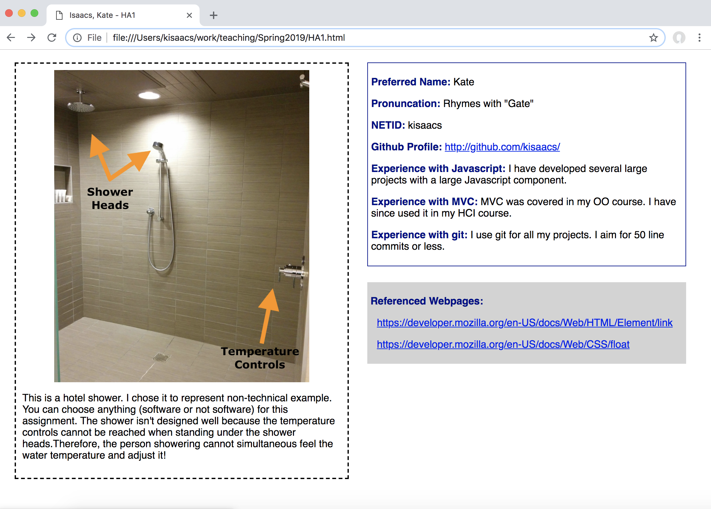

## Homework Assignment 1

History:

- Clarification, 2019/01/16 - Images may be used in class later, bold font
  should be dark blue
- Clarification, 2019/01/11 - The box with the image should have dashed lines
- Clarification, 2019/01/10 - You should create the two files for submission.
- Released, 2019/01/08

In this assignment we are:

- Thinking about how design affects your life
- Providing the instruction staff with basic information about yourself
- Demonstrating use of HTML and CSS

Create a simple webpage using only HTML and CSS. Do not use any Javascript or
Javascript libraries. Style/presentation should be in a separate CSS file. No
style information should be in the HTML tags. Do not use HTML tags like
`
`, `<b>`, or `<i>` to alter visual appearance.

Use the following link to create your github repository for this assignment:
[https://classroom.github.com/a/Lg2uxLgy](https://classroom.github.com/a/Lg2uxLgy)
At the time of submission, your git repository should contain one HTML file
named `HA1.html` as well as a CSS file names `HA1.css` and an image file.
Please create these files as part of the assignment.

The webpage should consist of two side-by-side columns. All elements should
have a minimum of five pixels of spacing between each other and the edges of
the browser. Use a twelve point sans serif font. The title of the webpage
should be "Last Name, First Name - HA1" where your last name and first name
are used.

This assignment will be graded based on adherence to the specifications in
terms of both content (e.g., image, questions about image, answers to labeled
questions), style (e.g., spacing, boxes, borders, fonts), and constraints
(e.g., no style in HTML).

#### Column 1

The first column should be 500 pixels wide. In it should be a single box with
a two pixel black border with dashed lines. There should be at least five
pixels of spacing between the border and anything inside of it. Within the box
there should be:

- Top, centered: An image of something from your life that is not designed
  well (e.g., difficult, frustrating, or clumsy to use), showing why you
believe it is not designed well. The "something" can be software but does not
have to be. The image should appear no more than 400 pixels wide on the page.
Clicking on the image should navigate to the full image.

**You should choose something from your own life experience -- something you
have noticed or used yourself. Do not do an online search for images of poor
design. You should be able to explain what's wrong from personal experience.
You can take you own photographs or you can search for a pre-existing
photograph of that thing. If you use a pre-existing photograph, it should be
cited. These images may be used as examples in class -- please let the
instructor know if you would like your image to be anonymous or if you would
be uncomfortable with its use.**

- Underneath the image, left justified: Text explaining (1) what the image is
  showing, (2) why you chose it, and (3) why it isn't designed well.

#### Column 2

The second column should also be 500 pixels wide. It should be separated from
the first column by at least 25 pixels. It should contain two portions.

##### Box 1

The first portion should be in a box with a one pixel dark blue border. There
should be at least 5 pixels of spacing between the border and anything inside
of it. The box should be aligned with the top of the dashed box in the first
column. Inside the box, include each label below in bold darkblue  with your
answer in a normal weight font:

- Preferred Name
- Pronunciation of your Preferred Name
- NETID
- Github Profile
- Experience with Javascript
- Experience with MVC
- Experience with git

The Github Profile response should be a clickable link to your Github profile.

Your Experience with Javascript, MVC, and git can be "None" if you do not have any.
If you have seen these in a class, please state so and how big a project you
have worked with using these technologies.

##### Box 2

Underneath the blue-outlined box, there should be another box with no border
but a lightgray background. This second box should be at least 25 pixels
between the blue-outlined box and the lightgray box. There should be at least
5 pixels of spacing between the edge of the lightgray part and anything inside
of it. It should include one label in bold as below:

- Reference Webpages

Any webpage you looked at to help you complete this assignment (e.g., a
specific StackOverflow answer or a particular MDN link) should be listed under
"Referenced Webpages". Each webpage listed should be a clickable link.  The
list should be indented 10 pixels as in the sample below:

