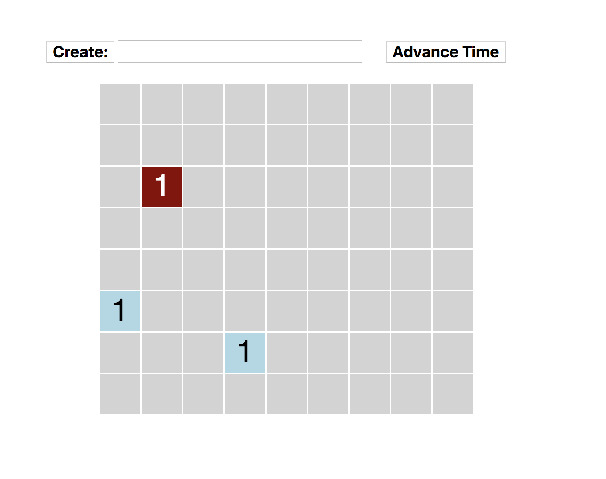

## Homework Assignment 2

Version History: 

- 2019/01/21: Released

In this assignment, we are exercising:

- GUI programming in HTML/CSS/Javascript
- the MVC design pattern

This assignment is based on an assignment from CSC 210 in Fall 2018, which was
also about GUI programming (in Java) and design patterns. 

Neither assignment is about UI design. For this assignment, follow the UI
design described below. We will consider better designs later this semester.

Do not use any Javascript libraries. The HTML, Javascript, and CSS should be
in separate files. No style information should be in the HTML tags. Do not use
HTML tags like `
`, `<b>`, or `<i>` to alter visual appearance.
Programmatically added SVG elements may have style attributes.

Use the following link to create your github repository for this assignment:
[https://classroom.github.com/a/WvHVxTnz](https://classroom.github.com/a/WvHVxTnz)
This will be initialized with the JS file `HA2.js.` Your submission git
repository should contain one HTML file named `HA2.html` as well as a CSS file
`HA2.css` and a JS file `HA2.js`.

The webpage should consist of a set of controls and a grid drawing area. The
title of the webpage should be "Last Name, First Name - HA2" where your last
name and first name are used.

### Background: Fish & Sharks

In this assignment, we simulate fish and sharks living in a grid ocean. Fish
move one square at a time, either in a down-right or up-left scheme. Sharks
move two squares at a time in the same pattern. When a shark encounters a cell
with fish, it eats all the fish. When between two and ten fish occupy the same
cell, they birth a new fish in a randomly chosen adjacent cell (without
sharks).

This logic is already implemented in the model for you. Do not alter the model
code in this assignment. 

### Persistent Elements

Both the controls and the grid should fit within a 600 pixel wide space that
is at least 50 pixels from the top and left of the page area in the browser.

#### Controls

The controls consist of seven buttons and two text fields. All text in the
controls should have bold, 15 pt sans serif fonts.

The first button is labeled `Create:`.

Next to the Create button is a text input field which should be 300 pixels
wide. Text inside should be have normal weight and be 15 pt sans serif.

The second is labeled `Advance Time`. There should be a gap of at least 25
pixels between this button and the end of the text input.

#### Grid

Initially, no grid should be shown. Any shown grid should be centered within
the 600 pixels.

When a grid size is set, each grid cell should be 50 x 50 pixels with a 1
pixels margin. Any text within a cell should be 30 pt sans serif and should be
vertically and horizontally centered. The background color and text color
should reflect the contents:

1. Nothing: Lightgray background
2. Fish: lightblue background with black text
3. Shark(s): darkred background with white text

### Functionality

There are two commands available to the user:

1. GRID X Y
2. X Y FISH MOVEMENT (ADD Command)

The user must type these commands into the text field and then click "Create:"
to have them accepted by the system. These commands are case **insensitive**.
Commands not fitting the format are ignored. (Errors should not appear in the
console for bad commands.)

Once the model is changed, the text input should be cleared.

#### The GRID Command

The user types `GRID` and then two integers to specify the size of the grid.

The command `GRID 4 5` creates a grid with 4 columns and five rows.

When the GRID command is successfully input, a new grid is created and
displayed. The grid should be empty. All previous data is forgotten.

#### The ADD Command 

The user types two integers to specify coordinates followed by a fish type and
a movement type.

The fish type can be `FISH` or `SHARK`. 

The movement type can be `LEFT` or `RIGHT`.

When the `Create:` button is pressed, an animal of the given type with the
given movement pattern should be added to the cell at the given coordinates
(X, Y). If X or Y are invalid, the command is ignored. (Errors should not
appear in the console for bad commands.)

### Advance Time

When the user clicks "Advance Time", the simulation should progress one step.

A movie demonstrating this functionality is available [here:
ha2-sample.mov](videos/ha2-sample.mov)

#### Defaults

When the page loads, there should be no grid displayed. Any containing
elements, such as a div which isn't visible, may be used.

### Organization

Your Javascript code should demonstrate the Model-View-Controller pattern as
we went over in lecture. 

The application data should be kept by the Model which notifies any Views upon
change.

Any changes to the DOM should be managed by the View. 

The Controller should act as the mediator, making changes to the model as
notified by the View. The Controller does not modify the View.

