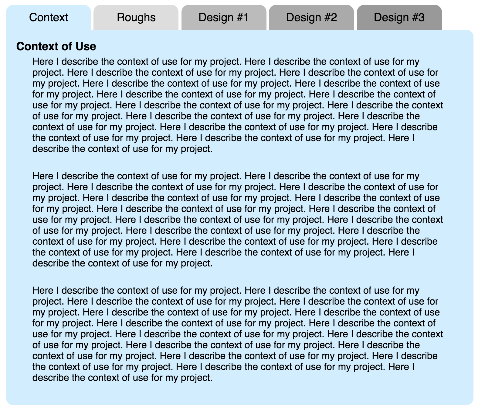
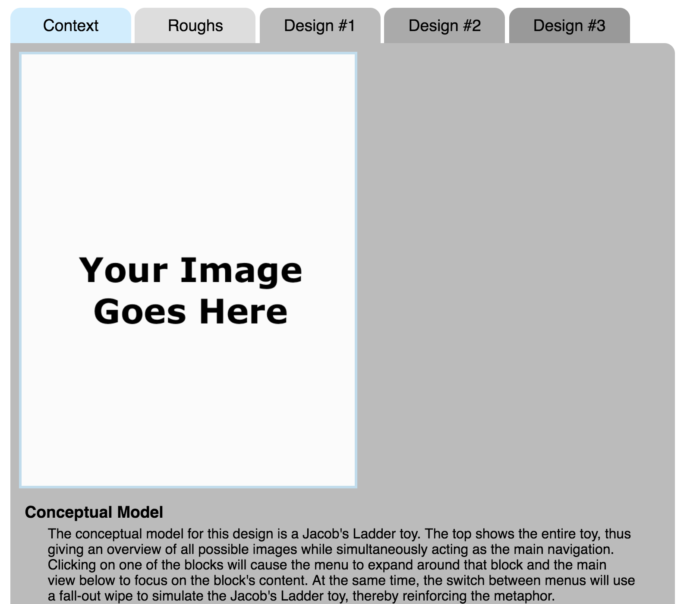

## Project Milestone 2

Version History: 

- Released 2019/2/11

The subject of the project is a stand alone ordering system for a restaurant,
such as those seen locally as places like In and Out Deli, Panera, and Jimmy's
Pita and Poke.

In this milestone we are:

- Stating the context of use of our stand alone ordering system
- Generating preliminary designs

The artifacts generated should be presented in a single HTML page as described
below. No style information should be in the HTML tags. Do not use
HTML tags like `
`, `<b>`, or `<i>` to alter visual appearance.
Programmatically added SVG elements may have style attributes.

Use the following link to create your github repository for this assignment:
[https://classroom.github.com/a/weWXyamW](https://classroom.github.com/a/weWXyamW)
At the time of submission, your git repository should contain one HTML file
named `PM2.html` as well as one CSS file and the included JS file. It should
also include any images or media needed for the report and `PM2.html`. 

### Content

For the purposes of this assignment, we are assuming the user goal of ordering
lunch.

#### Context of Use (10 pts)

Write clearly the context of use for your stand alone ordering system. All
three elements of the context of use should be described.

For example, as we discussed in class, some expect people walking up to be
seated later, some are for To-Go users only, and some are table-side. Some
accept credit only and some allow cash. Any of these is fine, but this should
be made clear.

#### Interface Design Sketches -- Brainstorming (25 pts)

Include images of your rough brainstorming sketches. Number each design. There
should be at least ten. Then, group the designs by commonality and explain why
they were grouped the way there were but what the differences between them
are. 

You will be graded on the diversity of designs, their appropriateness to the
user's task, and the thoroughness and thoughtfulness in explaining their
grouping. While you will not be graded on artistic ability, please use
annotations as necessary to communicate your design to others. 

Having difficulty coming up with ten unique designs? Consider looking through
design patterns. Consider looking at existing websites and apps, which may or
may not have to do with food. Consider picking a (potentially unrelated)
object and theming a design around that.

**You may include as many images as you need per section.**

#### Design Sketches -- Elaboration (54 pts)

Pick three of your most promising brainstorming designs and sketch an
elaborated design. The elaborated design should show the layout and
functionality. To elaborate on the design, you may need to draw the sketch in
more detail, include more windows/menus not seen in the initial design,
annotate more clearly to explain interactivity.

For each elaborated design, also explain the conceptual model, metaphor,
and/or inspiration as well as the advantages and disadvantages of the design,
including with respect to design principles/rationale, but also with any other
issues you think are of importance.

You will be graded on the choice of the three designs and whether they cover
your design space, the thoroughness in communicating the design and its
interactions, the thoroughness and appropriateness of the concept/metaphor
explanation as well as the explanation of the advantages and disadvantages. At
least three advantages and disadvantages of each design are expected.

### Format (11 pts)

Please write your report in a tabbed webpage as shown below with the section
titles `Context`, `Roughs`, `Design #1`, `Design #2`, and `Design #3` each in
14pt sans-serif font. They are color coded with `#CEF`, `#DDD`, `#BBB`,
`#AAA`, and `#999` respectively. The tabs are rounded on top. The content in
each tab should be 750 pixels wide. The shown body is rounded in all free
areas. 

Clicking on a tab should display the content of only that tab. All content
should be within a single HTML file. Do not use multiple files. Consider using
`display: none;` in CSS to hide content.

The body text should be 12 pt sans-serif and black. Blocks of text should be
prevented from running within 25pts of the left and right side. There should
be 20 pts of spacing underneath each block. Any section headings in the body
should be 14 pt sans-serif bold and at least 5 pts in all directions from any
other elements.

Images should be at most 500 pixels in any direction and surrounded by a 3
pixel border of color `#BDE` with a 10 pixel margin at the bottom. Clicking on
an image should link to a bigger view. Make full-size images no bigger than
2048 pixels wide.

**You may include as many images as you need per section.**

Lists (i.e., advantages and disadvantages) should halso have a bottom margin
of 20 pts and 5pts from the top. The bullet items should be 25 pts from either
left or right side.

Please write your report in the format described below. As with the previous
PM, the bulk of the credit is in the content, not in the format. 

  
  &nbsp;
  

A movie demonstrating the report format is available [here:
PM2-2019.mov](videos/PM2-2019.mov)

